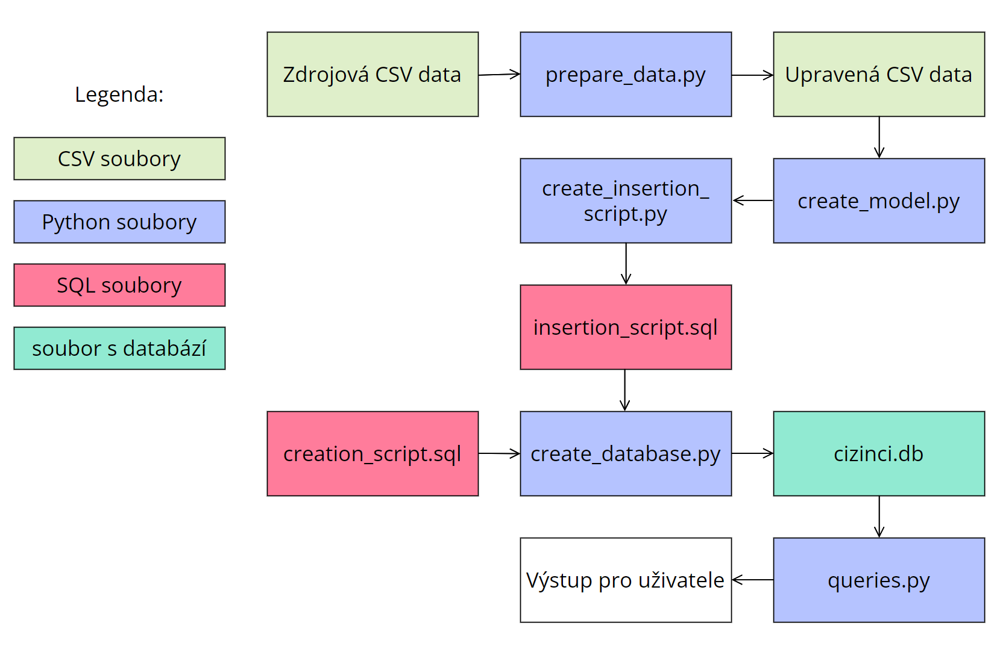
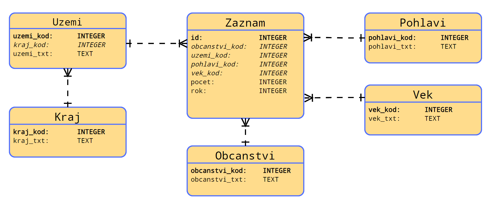

# Data o cizincích
Tento repositář slouží k prohlížení kódu, který byl vytvořen jako praktická část mojí bakalářské práce.  
Jako databázový relační systém je využit SQLite.  

## Spuštění programu
### Potřebné programy
Ke spuštění tohoto programu je potřeba mít nainstalovaný [Python](https://www.python.org/) a Python knihovnu [tqdm](https://pypi.org/project/tqdm/)  
Dále je potřeba z tohoto repositáře stáhnout:  
- cizinci.db - soubor s databází
- constants.py - soubor s konstanty
- queries.py - hlavní program s dotazy a uživatelským prostředím  

Po splnění všech požadavků lze program spustit pomocí příkazu `python queries.py` (terminál musí být otevřen ve složce se staženými soubory)

## Diagram závislostí
Tento diagram znázorňuje v jakém pořadí jsou jednotlivé soubory spoušteny a jaká data generují.  

## Relační model
Relační model databáze  

